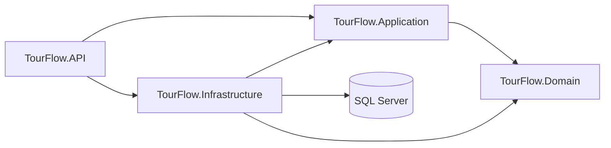

# Architecture

```mermaid
flowchart LR
    API[TourFlow.API] --> Application[TourFlow.Application]
    API --> Infrastructure[TourFlow.Infrastructure]
    Infrastructure --> Application
    Application --> Domain[TourFlow.Domain]
    Infrastructure --> Domain
    Infrastructure --> SQL[(SQL Server)]
```

The domain layer has no project dependencies. Application defines use cases and contracts; Infrastructure implements technical concerns; API composes the application.
