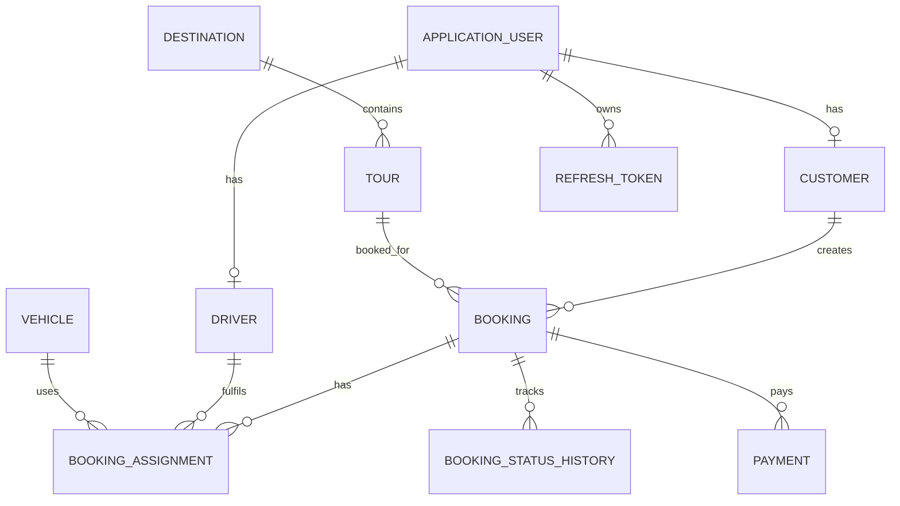

# Database ER diagram

Milestone 1 intentionally contains no business entities. The initial target relationship model is documented here and will be implemented in Milestones 2 and 3.

```mermaid
erDiagram
    APPLICATION_USER ||--o| CUSTOMER : has
    APPLICATION_USER ||--o| DRIVER : has
    CUSTOMER ||--o{ BOOKING : creates
    DESTINATION ||--o{ TOUR : contains
    TOUR ||--o{ BOOKING : booked_for
    BOOKING ||--o{ BOOKING_ASSIGNMENT : has
    DRIVER ||--o{ BOOKING_ASSIGNMENT : fulfils
    VEHICLE ||--o{ BOOKING_ASSIGNMENT : uses
    BOOKING ||--o{ BOOKING_STATUS_HISTORY : tracks
    BOOKING ||--o{ PAYMENT : pays
    APPLICATION_USER ||--o{ REFRESH_TOKEN : owns
```
